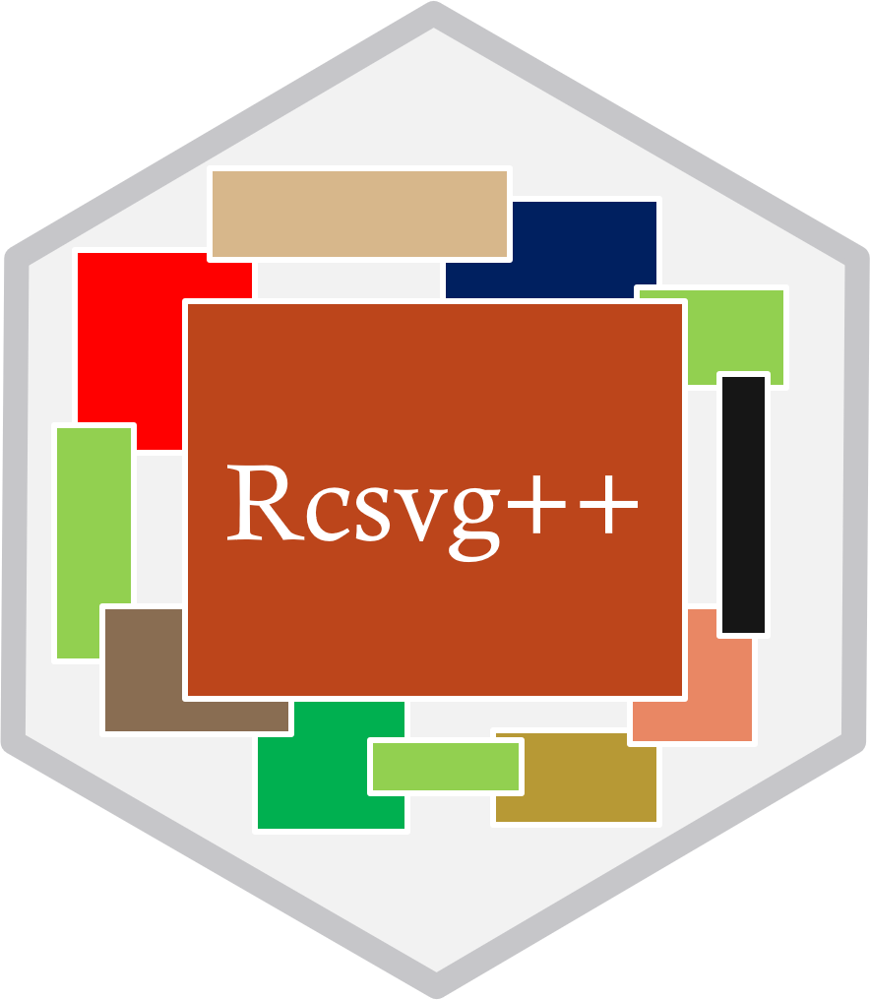

<!-- README.md is generated from README.Rmd. Please edit that file -->

# RcsvgPP </a>

<!-- badges: start -->
<!-- badges: end -->

The goal of RcsvgPP (R CSV Glue) is to make the job easier to glue
multiple CSV files from a folder destination into one data frame. You
can choose to glue data by the same number of columns or by the exact
column names and order. The main function glue_files_from_folder can
give the user the flexibility to use external libraries e.g. readr to
read data from the folder destination. It is not limited to just CSV
files if you use an external package. The user can also use the
glue_data function to join multiple data frames in a list into one data
frame. The main function performs a union all join to glue data
together.

## Installation

You can install the development version of Rcsvg from
[GitHub](https://github.com/) with:

``` r
# install.packages("devtools")
devtools::install_github("John-Piper/RcsvgPP")
```

## Usage

This is a basic example which shows you how to solve a common problem:

``` r
library(RcsvgPP)


# How to load in CSV files from a folder

df <- glue_from_folder(folder_path = "example_folder_location/for_csv_data/")


# How to load files that match the same column size where each file name ends with data

df <- glue_from_folder(folder_path = "example_folder_location/for_csv_data/",
                       pattern = "*data.csv",
                       check_header_names = FALSE)


# How to choose which files in the folder will be the file all other files have to match to be glued

df <- glue_from_folder(folder_path = "example_folder_location/for_csv_data/",
                       pattern = "*data.csv",
                       first_file = "main_file.csv")


# How to pass stringsAsFactors = FALSE when using the default read.csv when loading CSV files from a folder

df <- glue_from_folder(folder_path = "example_folder_location/for_csv_data/",
                       pattern = "*data.csv",
                       first_file = "main_file.csv",
                       stringsAsFactors = FALSE)


# How to use an external package like  with the Rcsvg packaged

library("readxl")

df <- glue_from_folder(folder_path = "example_folder_location/for_csv_data/",
                       pattern = "*data.csv",
                       first_file = "main_file.csv",
                       func = read_excel,
                       sheet = "example_sheet")


# The glue_data function can be used to perform a union all on data frames in a list. Only the data frames that match the first data frame in the list will be glued together to make a single data frame.  The glue_from_folder function is wrapper around the glue_data function.

df_list <- List(df_1, df_2, df_3, df_4)

merged_df <- glue_data(df_list, check_header_names = FALSE)
```
